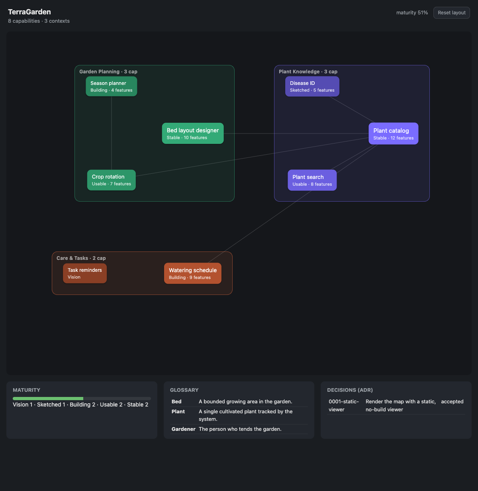

# 🗺️ Kartograph

**A living map of your software system — drawn together by you and AI.**

[](./LICENSE)
[](https://buymeacoffee.com/twissmueller)

Kartograph is a [Claude Code](https://code.claude.com) plugin that keeps a **living map**
of what your application does. The map is built on a small, explicit **ontology** of your
system, its behavior is captured as **executable specifications** (Gherkin scenarios in
version control), and new code is grown with **double-loop TDD** — acceptance scenarios as
the outer loop, unit tests as the inner loop. The map lives in your repo as a single
validated JSON file, is rendered by a live-reloading **desktop app**, and is grown through
AI workflows that always keep a human at the checkpoints.



---

## Why

Agentic AI assistants are extraordinary at writing code — and just as good at confidently
drifting away from what you actually meant.

For decades, the disciplined practices — TDD, ATDD, BDD — were the first thing squeezed
out of a project: writing the code consumed all the time, money, and mental energy. So we
started coding before our intent was clear, refactoring kept being postponed, and every
time the client changed their mind the mess compounded. Bad code was rarely a typing
problem; it was unclear intent, frozen into software.

AI inverts those economics. Code is no longer the bottleneck — clarity is. The scarce
skill now is laying your thoughts out in front of you, as a map, precisely enough to see
where you want to go — and holding the AI to it. That is what Kartograph gives you and
your AI assistant:

- **A shared language.** A ten-term ontology plus a project glossary, so "what the system
  does" is stated in named, defined terms — not re-derived from the code on every prompt.
- **Executable specifications.** Every behavior is a Gherkin scenario in version control:
  deterministic, reviewable, and stable while implementations come and go. The scenario is
  the contract the agent works against — a fitness function it iterates toward.
- **A verifiable definition of done.** A capability's maturity is *computed* from its
  acceptance scenarios, never claimed — not by the AI, and not by you.

Six months later — or six prompts later — the map tells you which behaviors are specified,
which are implemented, which are hardened with edge and error paths, and *why* the
architecture is the way it is.

## The ontology

Kartograph describes any application with ten terms:

**Actor** · **Capability** · **Context** · **Event** · **Feature** ·
**Glossary** · **Rule** · **Scenario** · **Subject** · **ADR**

> *An application takes **Subjects** in and transforms them by **Rules** into other Subjects
> or **Events**. **Capabilities** are the abilities to do that; **Features** are their
> deliverable parts; **Scenarios** are concrete examples; **Actors** trigger them;
> **Contexts** group everything into areas; the **Glossary** pins down the words; **ADRs**
> record why.*

This is deliberately small. It is not a modeling exercise — it is the minimum structure an
AI assistant needs to reason about your system without misunderstanding it, and the minimum
a human needs to find their way around it. Everything is slug-keyed and cross-referenced,
and every reference is checked: the ontology is a guardrail, not documentation.

## The workflow: BDD with an agent in the loop

Kartograph's three core phases line up with the three practices of BDD — **discovery**,
**formulation**, **automation** — with a human checkpoint and deterministic validation
between each:

| Phase | BDD practice | Command | What it does |
| --- | --- | --- | --- |
| **Explore** | Discovery | `/karto-explore <feature>` | Survey a feature *with you* (brainstorm + a converging interview), then discover Subjects, Events, Actors, Rules, affected and candidate Capabilities, and ADR candidates. Read-only — writes a survey, nothing else. |
| **Chart** | Formulation | `/karto-chart` | Record the approved survey onto the map: update `.kartograph/kartograph.json`, grow the glossary, write `.feature` scenarios in Gherkin, add ADRs. |
| **Build** | Automation (ATDD) | `/karto-build <capability>` | Implement the open scenarios with **double-loop TDD**: the acceptance scenario is the outer loop, red–green–refactor unit testing is the inner loop. |

The outer loop is what makes agentic development converge instead of drift: the agent's
starting prompt *is* a set of acceptance criteria, it can self-verify against them, and the
scenarios remain the stable truth in version control after the implementation has been
rewritten three times.

Four more commands view and maintain the map:

| Command | What it does |
| --- | --- |
| `/karto-show` | Open the live desktop app on the current project. |
| `/karto-init` | Bootstrap a draft map from an **existing** codebase. |
| `/karto-sync` | Re-scan the code and propose drift (add new, flag missing — never delete), plus glossary/ADR/dependency grooming. Non-destructive; you approve every change. |

`/karto-build-all [scope]` builds every open scenario in a scope autonomously — the whole map,
`context:<slug>`, or a `<capability-slug>` (and its dependencies). It computes a dependency-ordered
plan, then spawns one build subagent per capability (each in its own context window), taking every
scenario it can walk end-to-end to **Developed**. **Accepted** stays your call. Capabilities with no
charted scenarios are skipped and listed (chart them with `/karto-explore`).

## Guardrails: what makes the map trustworthy

- **Deterministic gates.** Every write is validated against a JSON Schema *and* a
  referential-integrity check (no dangling references), then swapped in atomically. A failed
  write is a no-op — the map is never left half-written. The creative work is the LLM's;
  the correctness is deterministic code's.
- **Maturity is derived, never declared.** A Capability's level is computed from its
  `.feature` files, not hand-set: `vision` → `sketched` → `building` → `usable` → `stable`,
  driven by which scenario paths (`@happy`, `@edge`, `@error`) actually exist. `usable`
  requires an edge path; `stable` requires edge *and* error. No scenario, no credit —
  for humans and AI alike.

## Quickstart

```bash
git clone https://github.com/twissmueller/kartograph.git
cd kartograph
npm install
npm test                                    # run the test suite
npm run validate                            # validate the seed map

# preview the demo map in the desktop app (first run installs Electron)
mkdir -p .kartograph && cp examples/demo.kartograph.json .kartograph/kartograph.json
bash scripts/start-desktop.sh "$(pwd)"      # opens a native window on this project
```

Drag nodes to arrange them (positions are saved to `.kartograph/kartograph.layout.json`); edit
`.kartograph/kartograph.json` and the app reloads itself.

The desktop app has two views, switched from the header: the **Map** (the capability graph) and
the **Tracking** board — a cross-capability view of every scenario by progress (Open / Developed /
Accepted). Change a scenario's state to record its tracking progress, which is stored
in `kartograph.json` (not in the `.feature` file); progress is tracking-only and does not
change derived maturity.

Click a capability to read each of its features and scenarios with their full Gherkin steps,
filter scenarios by path (`@happy` / `@edge` / `@error`), and see at a glance — via per-feature
coverage badges — which paths each feature still lacks. It updates live as you edit
`.feature` files, so you can grow the software both exploratively and systematically.

## Install as a Claude Code plugin

This repo is its own [plugin marketplace](https://code.claude.com/docs/en/plugin-marketplaces).
In Claude Code:

```text
/plugin marketplace add twissmueller/kartograph   # add the catalog (owner/repo)
/plugin install kartograph@twissmueller           # install kartograph from twissmueller
```

Then, in any project you want to map:

```text
/karto-init                 # bootstrap a map from existing code
/karto-explore "<feature>"  # design a new feature
/karto-show                 # open the live desktop app
```

### Updating

Updating is two stages: refresh the catalog, then upgrade your installed copy. Both compare
the manifest `version`, so **every release must bump `version`** — ship commits without
bumping it and nothing downstream sees a change.

**Stage 1 — refresh the catalog** (in Claude Code):

```text
/plugin marketplace update twissmueller   # re-pull marketplace.json; says "1 plugin bumped" when a new version exists
```

This only refreshes the catalog — it does **not** touch your installed copy.

**Stage 2 — upgrade the installed plugin.** There is *no* `/plugin update` slash command
(typing it just opens the `/plugin` manager). Use one of:

- **Interactive:** `/plugin` → *Installed* → select **kartograph** → `Enter` → update, then `/reload-plugins`.
- **Terminal:** `claude plugin update kartograph@twissmueller`

Or skip both stages: enable **auto-update** for the marketplace in `/plugin` → *Marketplaces*,
which upgrades installed plugins at session start (you'll be prompted to run `/reload-plugins`).
Uninstall + reinstall forces it too.

> **After an update, run `/reload-plugins` (or restart Claude Code) before the new commands
> appear.** Slash commands load at session start, so a session that was already running when the
> plugin updated won't list newly-added commands (e.g. `/karto-build-all`) until you reload.

## What lives in your repo

```
.kartograph/
  kartograph.json          the map (validated, slug-keyed)
  kartograph.layout.json   node positions (desktop-app-written)
kartograph/
  surveys/                 dated survey notes from /karto-explore
  decisions/               ADRs (Markdown, MADR style)
features/<context>/<capability>/*.feature   the behavior, in Gherkin
```

## Status

Kartograph is built in milestones:

- ✅ **M1a — foundation & viewer**: schemas, validator + integrity gate, the seed map, the
  static live-reloading viewer, and `/karto-show`.
- ✅ **M1b — explore & init**: `/karto-explore` and `/karto-init` commands, the `karto-grill`
  and `karto-analyze-repo` skills, the discovery schema + validator, and the dynamic
  workflows. *(Schema and helpers are unit-tested; the live workflow behavior is verified by
  running the commands in Claude Code.)*
- ✅ **M2 — chart**: `/karto-chart` and `/karto-sync`, the glossary/ADR grooming skills, the
  chart workflow, and the deterministic discovery→map transform + maturity reconciliation from
  `.feature` files. *(Pure transforms are unit-tested; live charting is verified in Claude Code.)*
- ✅ **M3 — build**: `/karto-build` with double-loop TDD driven entirely by the map's
  `.feature` scenarios — no separate config — plus the open-scenario helper. *(Helpers
  unit-tested; the TDD loop runs live.)*

See [`docs/superpowers/specs`](docs/superpowers/specs) for the full design.

## Built with

No framework, no build step — vanilla JavaScript and Node's built-ins. Skill *ideas* are
adapted from [mattpocock/skills](https://github.com/mattpocock/skills); the explore and build
phases use and honor the [Superpowers](https://github.com/obra/superpowers) skills
(`brainstorming`, `test-driven-development`). See [`NOTICE`](./NOTICE).

## Support

If Kartograph helps you, you can support its development:

<a href="https://buymeacoffee.com/twissmueller"></a>

## License

[MIT](./LICENSE) © 2026 Tobias Wissmüller
