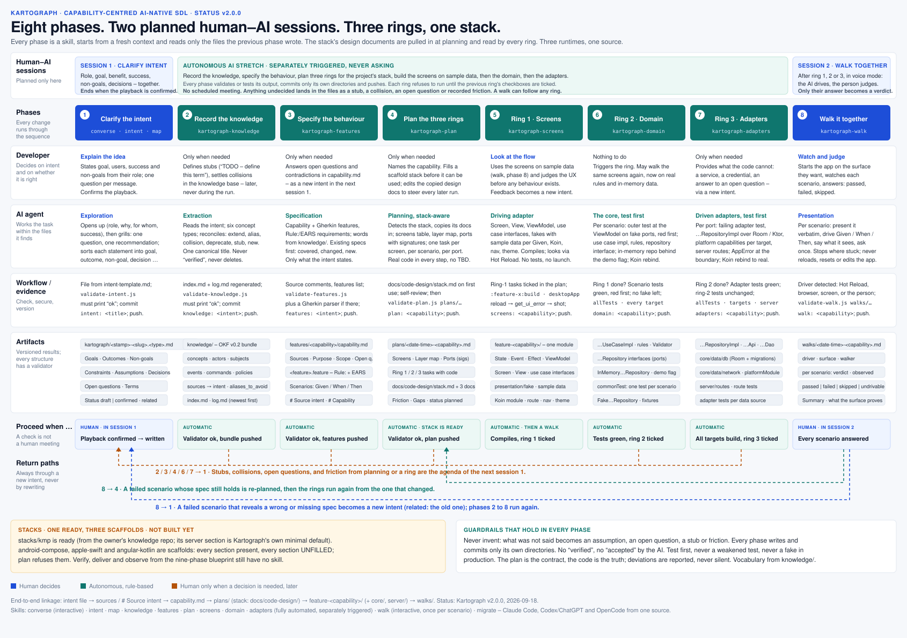

# 🗺️ Kartograph

**Draw out what a person really wants, write down the words it is made of and the behaviour it asks for, plan it in three rings, show the screens first, build the rest, then walk them through it.**

[](./LICENSE)
[](https://buymeacoffee.com/twissmueller)

Kartograph is a plugin for [Claude Code](https://code.claude.com),
[Codex](https://developers.openai.com/codex) and [OpenCode](https://opencode.ai) with eight
skills that build on each other through plain files in your repository:

| skill | reads | writes |
|---|---|---|
| **`kartograph-explore`** | a conversation with you | `intents/<date>-<slug>.md` |
| **`kartograph-knowledge`** | one intent file | `knowledge/`, an Open Knowledge Format bundle |
| **`kartograph-features`** | one intent file | `features/`, capabilities and Gherkin features |
| **`kartograph-plan`** | one capability, the stack's design docs | `plans/<date>-<capability>.md`, three rings; `docs/code-design/` on first use |
| **`kartograph-screens`** | ring 1 of the plan | the screens and view models on fakes with sample data |
| **`kartograph-domain`** | ring 2 of the plan | use case implementations, rules, ports, one test per scenario |
| **`kartograph-adapters`** | ring 3 of the plan | repositories, database, API client, platform capabilities, server |
| **`kartograph-walk`** | any ring's result, and you watching | `walks/<date>-<capability>.md`, your verdicts |

Each run starts from a fresh context. What one skill knows, it knows from the files the
previous one wrote, so everything worth keeping is in your repo, versioned, and readable
by you, a colleague, or a later AI session.



## Why

AI assistants write code faster than anyone can think. What they cannot do is know what you
meant. Every drifting implementation, every "that's not what I asked for", starts with an
intent that lived only in someone's head and was never pulled out and written down. And once
written down, the words it uses drift too, unless they are defined once and reused. And once
the words hold, the screens should be seen before the behaviour behind them is committed to.

## `kartograph-explore` — one conversation, one intent file

The conversation has two halves:

1. **Opening up.** Before any solution is on the table: who you are in this, what you want
   and why, who it is for, and how you would recognise success. When your goal could be
   read two ways, the AI reflects both back and lets you pick.
2. **Converging.** Then it grills you, one question at a time, always with a recommended
   answer, until it can play your whole intent back and you say nothing is missing. Vague
   words get sharpened into concrete cases. Solutions get asked what outcome they serve.
   Non-goals get asked for explicitly. Decisions get recorded with their reasons and the
   alternatives you rejected. Anything you cannot answer yet becomes an open question with
   a name next to it, not a loop.

The intent file has the same sections every time, and an empty section says so: summary,
who (your role, who benefits, who is affected), goals, intended outcomes, non-goals,
constraints, assumptions, decisions with reasons, open questions with who can answer them,
terms, notes. It is written in the language of the conversation.

## `kartograph-knowledge` — one intent, a growing knowledge base

Reads the intent you name, or the newest one, and records every concept it introduces in
`knowledge/`, a bundle in Google's
[Open Knowledge Format](https://github.com/GoogleCloudPlatform/knowledge-catalog/blob/main/okf/SPEC.md)
v0.2: one markdown file per concept, YAML frontmatter plus a body, the path being the
concept's identity.

```
knowledge/
  index.md      generated listing, grouped by type
  log.md        one entry per processed intent, newest first
  concepts/     a domain word with a definition
  actors/       a role or system that acts
  subjects/     a thing acted upon, with a lifecycle
  events/       something that happened, past tense
  commands/     an action an actor issues, imperative
  policies/     when <event> then <command>, or a constraint that must hold
```

Every concept records where it came from (`sources` points back at the intent, with
footnoted quotes in the body), who generated it, and its lifecycle (`draft`, `stable`,
`deprecated`). One canonical title per concept: a synonym joins `aliases_to_avoid` instead
of becoming a second file. Existing definitions are extended, never rewritten; a
contradicting intent is recorded under a `# Collision` heading for a person to settle. A
word the intent uses but never defines becomes a draft stub that says so, not a guess.
Retired concepts are deprecated, never deleted.

The run is fully automated: it asks nothing, writes, commits, pushes, and reports the
stubs and collisions left for you.

## `kartograph-features` — one intent, the behaviour it asks for

Reads the intent you name, or the newest one, and turns it into what the product must let
someone achieve and how that behaves, under `features/`:

```
features/
  <capability>/
    capability.md          the lasting ability: sources, purpose, scope, constraints, open questions
    <feature>.feature      one Feature, plain Gherkin, scenarios optionally grouped under Rule:
    <sub-capability>/      the same shape, as deep as the product needs
      capability.md
      <feature>.feature
```

Feature files are plain Gherkin. Each scenario is a concrete example in the domain's own
words, using the canonical titles from `knowledge/` and never a word listed there as an
alias to avoid. Every feature file names the intent and capability it came from. Older
trees written by Kartograph v0 are moved onto this shape by
`node scripts/migrate-features.js <project>`, which never touches a scenario.

It reconciles before it writes. A behaviour already covered by an existing scenario is
linked, not duplicated. A behaviour an intent changes updates only the steps that
changed, since scenario steps may be bound to step definitions downstream. A behaviour
the intent leaves undecided becomes an open question in `capability.md`, never a scenario
with a guessed outcome. A contradiction with an existing agreement is recorded with both
statements, never resolved by the AI. Nothing is removed unless the intent says so.

Fully automated, like knowledge: no questions, then commit, push, and a report of what
was created, updated, reused, and left open.

## `kartograph-plan` — three rings, for your stack

Before anything is built, the plan. You name the capability; the skill reads its
scenarios, `knowledge/`, the stack's design documents, the existing module, `core/`,
`server/`, the build and the last walk, and writes `plans/<date>-<capability>.md`, a
hexagon read through Clean Architecture:

- **Screens** table: one per feature file unless the scenarios clearly describe more than
  one place, each listing the scenarios it serves and the controls their steps name.
- **Layer map**: which layers each scenario crosses and its entry point.
- **Ports and adapters** with exact Kotlin signatures, **files** to create or modify,
  **global constraints** copied from the stack's documents.
- **Ring 1: Screens**, one task per screen: types, use case interfaces, ViewModel, fakes
  with sample data covering every listed scenario's `Given`, Screen and View, Koin and
  navigation, compile and see. No tests in this ring.
- **Ring 2: Domain**, one task per scenario: the outer test at the ViewModel against fake
  repositories, red first; then per layer a failing test and minimal code; the Koin
  rebind from fake use case to implementation; the in-memory repository behind a demo
  flag.
- **Ring 3: Adapters**, one task per port or endpoint: the failing adapter test, the
  implementation, the Koin rebind from in-memory to real.
- **Friction** for scenarios that cannot be built as written, **gaps** for what the
  project cannot provide.

Modelled on superpowers' writing-plans: written for an implementer who sees only their
task, exact signatures in an interfaces block per task, and no placeholders anywhere, no
"TBD", no "add error handling", no "similar to task 2.3". The validator rejects every
such pattern and cross-checks screens, layer map, tasks and the feature files against each
other. Fully automated, committed as `plan: <capability>`, pushed. A re-plan supersedes
the earlier plan.

### Technology stacks

Plan is the one skill that knows about stacks. On a project's first plan it detects the
stack from the build files, refuses if it sees none, more than one, or a scaffold, then
writes `docs/code-design/stack.md` declaring the choice and copies the stack's three
documents beside it:

```
docs/code-design/
  stack.md            which stack, which version, when declared
  design-system.md    tokens, theme entry point, components, layout, accessibility
  code-design.md      the three rings, module layout, state contract, naming, DI, navigation
  build-design.md     ports and adapters in detail: persistence, HTTP, platform, server, tests, done
```

From then on every skill reads the project's copies, so your edits steer every later run.
The plugin ships the stacks under `stacks/`, one directory each:

| stack | status | detected by |
|---|---|---|
| `kmp` | ready | `settings.gradle.kts` plus a `kotlin("multiplatform")` module |
| `android-compose` | scaffold | an Android application module without multiplatform |
| `apple-swift` | ready | `Package.swift`, an `.xcodeproj` or a `project.yml`, no Gradle |
| `angular-kotlin` | scaffold | `angular.json` beside a Kotlin server build |

A scaffold carries every section a stack must answer and an unfilled marker in each; plan
refuses to run against it. Adding a stack is adding a directory with a `STACK.md` and the
three documents. The KMP stack derives from its owner's knowledge repository and reads
Clean Architecture plus MVVM as the hexagon: screens are the driving adapter, use cases
and ports the core, repositories, data sources and the Ktor server the driven adapters.

## `kartograph-screens` — ring 1, the flow before the behaviour

Executes ring 1 of the plan: the screens, the view models, the use case interfaces and
fake use cases holding deterministic sample data, so every scenario can be walked in the
running app and you can judge the flow before anything real is built. Every control a
scenario names carries the scenario's own words, so a person and a semantic tree can find
it. It compiles the module and the desktop target, reloads and screenshots each screen
when a Compose Hot Reload window is connected, never launches the app, never scaffolds a
project, builds nothing a scenario does not state, commits as `screens: <capability>`,
pushes, and tells you which scenarios to walk. This is where you stop and look.

## `kartograph-domain` — ring 2, the behaviour, data still local

Executes ring 2 once every ring-1 checkbox is ticked. Per scenario: the outer test at the
ViewModel against fake repositories, red first; then use case implementation, rules and
repository interface, each behind a failing test; then the Koin rebind from the fake use
case to the real one. The ring-1 sample data becomes an in-memory repository behind a
demo flag, so the same screens now run on real rules and the walk still works before a
backend exists. Fakes over mocks, no mocking library, no weakened assertion, never an
edited feature file. Commits as `domain: <capability>`, pushes.

## `kartograph-adapters` — ring 3, real data, real platform, real server

Executes ring 3 once every ring-2 checkbox is ticked. Per port or endpoint: the failing
adapter test (Room over an in-memory driver, Ktor over `MockEngine`, the server over
`testApplication`, a platform capability in its target's test source set), the data
source, mapper and adapter, the Koin rebind from in-memory to real. Exceptions stop at the
repository boundary as `AppError`. Nothing above the repository interface changes, and the
ring-2 scenario tests must still pass unchanged. Commits as `adapters: <capability>`,
pushes, and says the capability is real end to end.

Screens, domain and adapters all execute the plan as the contract and the code as the
truth: a step the code contradicts gets the smallest correction that keeps its intent,
reported, never silent; the plan's only edit is its checkboxes.

## `kartograph-walk` — you watch, it drives, you judge

Presents what was built, scenario by scenario, in the running app, after any ring: the
screens on sample data, the domain on in-memory data, or the finished feature. You start
the app on the surface you want to see it on; the skill picks the driver that can reach
it: Compose Hot Reload for a desktop window, Claude in Chrome or Playwright for a web UI,
a screen-control tool for the iOS simulator, a native macOS app or an iPhone or iPad
mirrored to the Mac, and if none can, you drive while it narrates.

For every scenario, in this order: it shows the feature title and the scenario text
verbatim from the file, then drives it, bringing the app into the `Given` through the UI,
taking the `When` as a user would, and saying in the scenario's own words what it actually
sees at the `Then`, with a screenshot. Then it asks: passed, failed, or skipped. It paces
like a person would: no question after trivial steps, one "with me so far?" where a viewer
could lose the thread on a long scenario.

The guardrails are the point. Its observation is never the verdict. It stops and says
where it got stuck rather than improvising, and never edits the app, its data or a feature
file to make a scenario walkable. It never reloads, restarts or resets the app under test,
and never starts it. Anything destructive is confirmed with you first. It narrates in plain
domain language, never files, selectors or code.

It is meant to be run in voice mode (ChatGPT or Codex), so you keep the app full screen
and talk instead of type: the scenario is read aloud step by step, each action is
announced before it happens, what is seen is said in one sentence, and the question is
answerable with a word. Nothing technical is ever spoken; that stays in the written record.

The walk ends in `walks/<date>-<capability>.md`: driver, surface, one section per scenario
with the verdict and your words on a failure, a summary, and one line saying what that
surface proves. Committed as `walk: <capability>`, pushed. Feature files stay untouched.

## Install

### Claude Code

```
/plugin marketplace add twissmueller/kartograph
/plugin install kartograph@twissmueller
```

Then, in any project:

```
/kartograph:kartograph-explore I want the app to work without a network connection
/kartograph:kartograph-knowledge
/kartograph:kartograph-features
/kartograph:kartograph-plan project-archiving
/kartograph:kartograph-screens
/kartograph:kartograph-walk project-archiving
/kartograph:kartograph-domain
/kartograph:kartograph-adapters
/kartograph:kartograph-walk project-archiving
```

The first three also trigger on their own when the situation fits. Plan and walk need
the capability or feature named; screens, domain and adapters take the newest plan when
you name none.

### Codex and the ChatGPT app

Register the repository as a marketplace, then install from it. The ChatGPT desktop app
reads the same configuration; restart it afterwards and start a new chat.

```
codex plugin marketplace add twissmueller/kartograph
codex plugin add kartograph@twissmueller
```

Later releases: `codex plugin marketplace upgrade twissmueller`. Plugins are not
available in the IDE extension.

### OpenCode

OpenCode plugins register tools rather than skills, so the plugin exposes the skills as
tools named `kartograph_explore`, `kartograph_knowledge`, `kartograph_features`,
`kartograph_plan`, `kartograph_screens`, `kartograph_domain`, `kartograph_adapters` and
`kartograph_walk` that hand the model the same `SKILL.md`. Add the npm package to
`opencode.json`:

```json
{ "plugin": ["opencode-kartograph"] }
```

OpenCode also reads skills straight from `~/.agents/skills/`, and Codex picks them up from
the same place; a copy of a single `skills/kartograph-*` directory works for every skill
except plan, which needs the plugin's `stacks/` directory beside it.

### Any agent that reads `SKILL.md`

The skills follow the [agentskills.io](https://agentskills.io) format and depend on no
runtime-specific tool. Drop the `skills/` directories wherever your agent looks for skills.

## Guardrails

- Each skill writes only its own output: explore the intent file, knowledge the
  `knowledge/` bundle, features the `features/` directory, plan the plan and the stack
  declaration, screens the feature module and its wiring, domain the module and `core/`,
  adapters the module's data layer, `core/` and `server/`, walk one record under `walks/`.
- Each commits only what it wrote (`intent:`, `knowledge:`, `features:`, `plan:`,
  `screens:`, `domain:`, `adapters:`, `walk:`) and pushes to the branch's upstream.
  Without git or a remote it says so and moves on.
- None invents. What was not said is an assumption, an open question, a stub, or
  friction; never a guessed rule, a guessed outcome, or a placeholder in a plan.
- None writes a `verified` stamp or claims a feature is approved, implemented or tested.
  In a walk, only your answer becomes a verdict.
- Screens, domain and adapters never edit a feature file, never weaken a test, never ship
  a fake in production, and never touch the plan's content.
- All drive. Explore ends every message with the next question or the written file;
  knowledge, features, plan, screens, domain and adapters ask nothing at all; walk asks
  once per scenario.
- Every file has a fixed structure, and each skill ships a validator it runs before
  committing:

  ```
  node skills/kartograph-explore/validate-intent.js intents/<file>.md
  node skills/kartograph-knowledge/validate-knowledge.js knowledge
  node skills/kartograph-features/validate-features.js features
  node skills/kartograph-plan/validate-plan.js plans/<file>.md
  node skills/kartograph-walk/validate-walk.js walks/<file>.md
  ```

  They need only Node, no dependencies. `npm test` runs the suite behind them.

## History

Versions up to `v0.21.2` were a much larger Kartograph: a living map of a software system
with a desktop app, validators, nine commands, and a build-and-walk pipeline. `v1.0.0`
restarted from the one step that mattered most; `v1.1.0` to `v1.6.1` added the knowledge
base, the features, the screens, the walk, the plan and the build. `v2.0.0` reordered
the middle: plan first, then three separately triggered rings, with the stack knowledge
pulled in from `stacks/`. `v2.1.0` let capabilities nest, made feature files plain
Gherkin, and added `scripts/migrate-features.js` for v0 trees.

## License

MIT — see [LICENSE](./LICENSE). Attributions in [NOTICE](./NOTICE).
